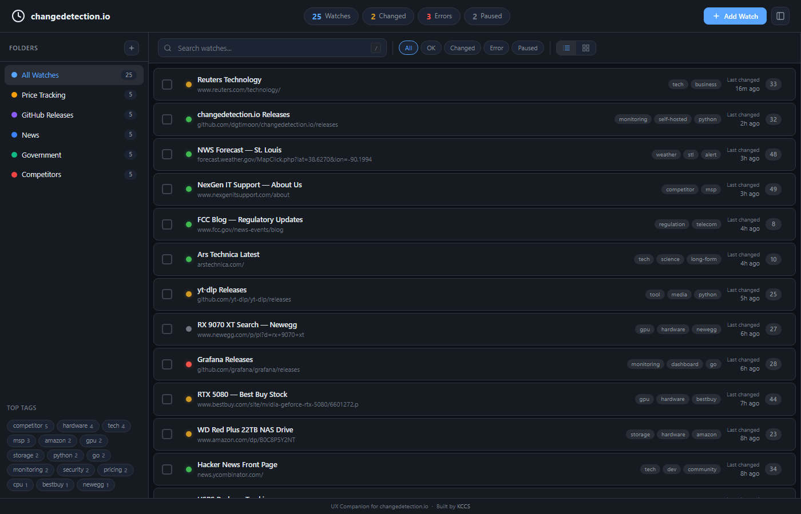

# changedetection.io UX Companion Dashboard

A modern, dark-themed companion dashboard that wraps the changedetection.io API with superior UX including folder organization, bulk operations, tag management, and inline diff viewing.



## Features

- **Folder Organization** — Group watches into collapsible folders (Price Tracking, GitHub Releases, News, Government, Competitors)
- **Tag Management** — Color-coded tag chips with filtering, bulk add/remove
- **Bulk Operations** — Select multiple watches for move, tag, pause, resume, or delete
- **Inline Diff Viewer** — Click any watch to see recent changes with red/green diff highlighting
- **Dual View Modes** — Toggle between compact row view and card grid view
- **Real-time Updates** — WebSocket connection pushes changes instantly
- **Keyboard Shortcuts** — `/` to search, `N` to add, `Ctrl+A` to select all, `Delete` to remove, `Esc` to close
- **Responsive** — Full mobile support with collapsing sidebar
- **Demo Mode** — 25 realistic watches with simulated change data out of the box
- **Dark Theme** — GitHub-dark inspired palette, easy on the eyes

## Quick Start

### Prerequisites

- Python 3.10+
- pip

### Install & Run

```bash
cd ux_companion
pip install fastapi uvicorn websockets
python -m uvicorn app:app --host 127.0.0.1 --port 8510 --reload
```

Open [http://127.0.0.1:8510](http://127.0.0.1:8510) in your browser.

The dashboard starts in demo mode with 25 pre-configured watches across 5 folders.

### Docker

```dockerfile
FROM python:3.12-slim
WORKDIR /app
COPY ux_companion/ ./ux_companion/
RUN pip install --no-cache-dir fastapi uvicorn websockets
EXPOSE 8510
CMD ["python", "-m", "uvicorn", "ux_companion.app:app", "--host", "0.0.0.0", "--port", "8510"]
```

```bash
docker build -t changedetection-ux .
docker run -p 8510:8510 changedetection-ux
```

## API Reference

### Watches

| Method | Endpoint | Description |
|--------|----------|-------------|
| `GET` | `/api/watches` | List all watches (supports `?folder_id=`, `?tag=`, `?status=`, `?search=`) |
| `POST` | `/api/watches` | Add a new watch |
| `PUT` | `/api/watches/{id}` | Update watch metadata (folder, tags, notes, status) |
| `DELETE` | `/api/watches/{id}` | Remove a watch |

### Folders

| Method | Endpoint | Description |
|--------|----------|-------------|
| `GET` | `/api/folders` | List all folders with watch counts |
| `POST` | `/api/folders` | Create a new folder |

### Changes

| Method | Endpoint | Description |
|--------|----------|-------------|
| `GET` | `/api/changes/{id}` | Get change history for a watch (`?limit=10`) |

### Bulk Operations

| Method | Endpoint | Description |
|--------|----------|-------------|
| `POST` | `/api/bulk` | Bulk action on multiple watches |

**Bulk action payload:**
```json
{
  "watch_ids": ["uuid1", "uuid2"],
  "action": "move_folder|add_tag|remove_tag|pause|resume|delete",
  "value": "optional-folder-id-or-tag-name"
}
```

### Statistics

| Method | Endpoint | Description |
|--------|----------|-------------|
| `GET` | `/api/stats` | Dashboard statistics (totals, changes today, top tags) |

### WebSocket

| Protocol | Endpoint | Description |
|----------|----------|-------------|
| `ws` | `/ws` | Real-time change notifications |

**Event types:** `watch_created`, `watch_updated`, `watch_deleted`, `bulk_action`

## Architecture

```
ux_companion/
  app.py              # FastAPI backend + demo data generator
  companion.db        # SQLite database (auto-created)
  static/
    index.html        # Single-file dark SPA (no build step)
  docs/
    screenshots/
      dashboard.png   # Dashboard screenshot
```

The companion dashboard runs as a standalone service. In production, it connects to a changedetection.io instance via its API. In demo mode (default), it generates 25 realistic watches with simulated change data.

## Screenshots

### Dashboard — Row View


## Tech Stack

- **Backend:** FastAPI + SQLite + WebSockets
- **Frontend:** Vanilla JS single-file SPA (zero dependencies, no build step)
- **Theme:** GitHub-dark inspired (#0d1117 base)

## License

Same as the parent changedetection.io project.

---

Built by [KCCS](https://kccsonline.com)
